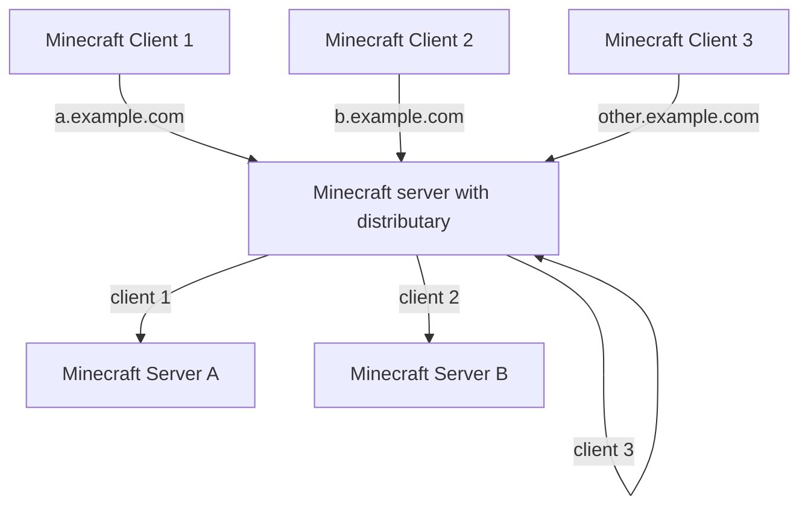

## distributary

A Minecraft reversed proxy that distribute connections to backend servers based on the host info in the handshake packet

In brief, this mod can recognize the server address used by the client when connecting to the server and use it as a routing identifier.
When the address matches a given list, this mod will forward the client connection to a specified backend Minecraft server.
At this point, the mod acts as a port forwarding tool.
For those client connections that do not match any of the configured addresses,
they will be directly connected to the current server as if this mod does not exist

